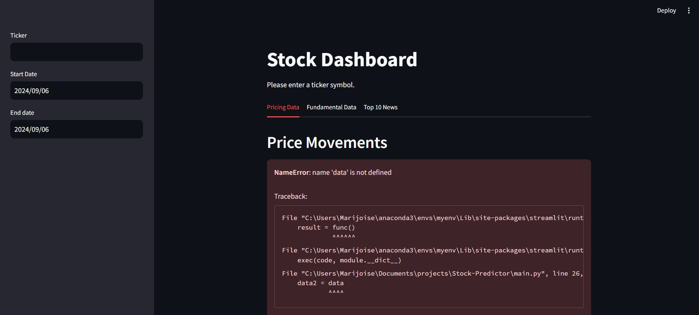
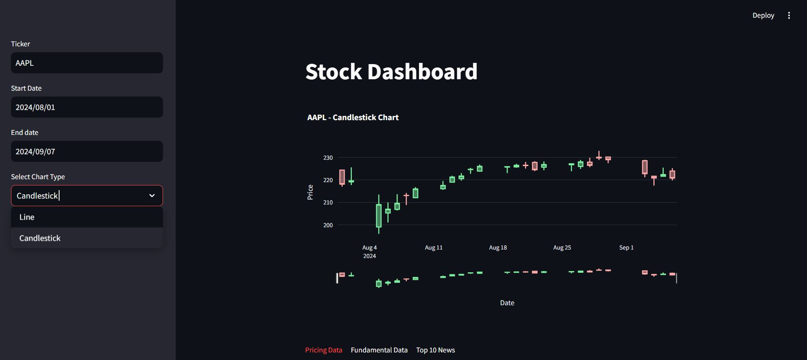
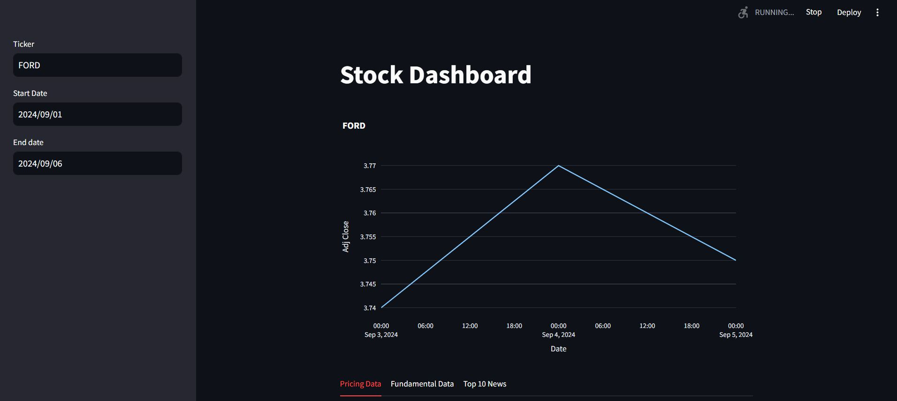
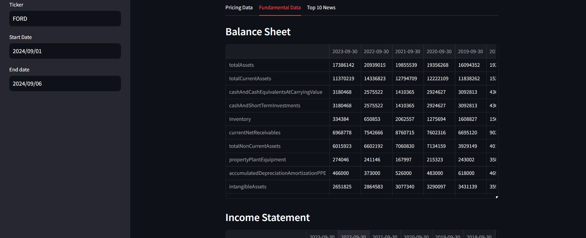

# Stock-Predictor

A predictor model for the stock market.
 
## Usage
go to Alpha vantage and get your own API key
it's free with limited actions. 

open your environment in terminal
```{bash}
pip install r requirements.txt
```
in the terminal, run the following command
```{bash}
 streamlit run main.py
```





### License
This project is licensed under the Apache2.0 License. See the LICENSE file for details.

### Contributing
Feel free to open issues or submit pull requests to improve this project. Contributions are welcome!

Contact
For any questions or issues, please contact kanyibrandon@gmail.com.
