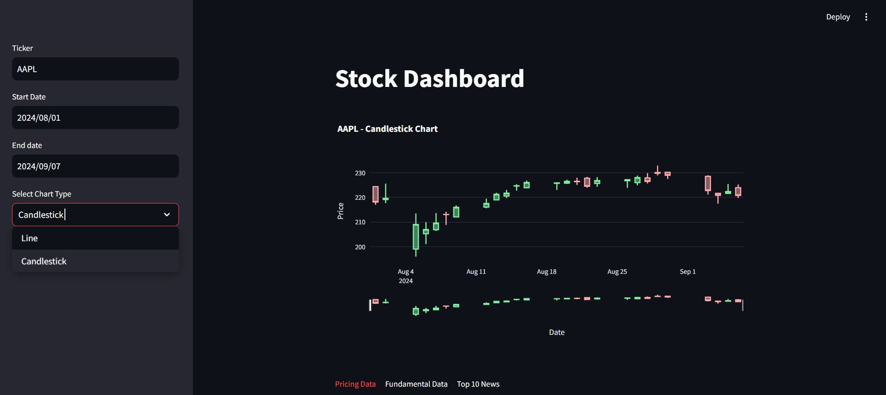
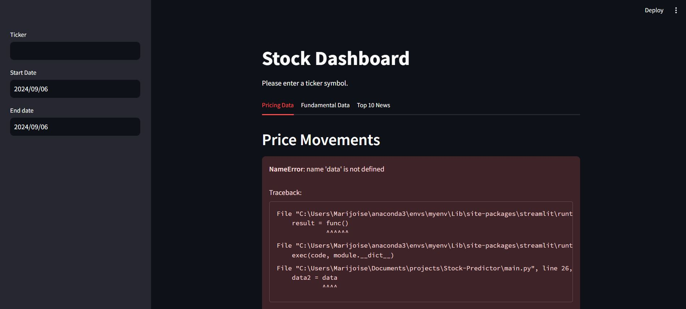
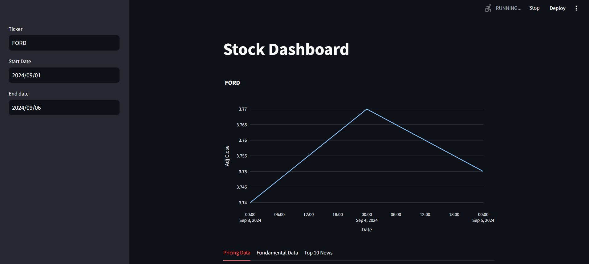
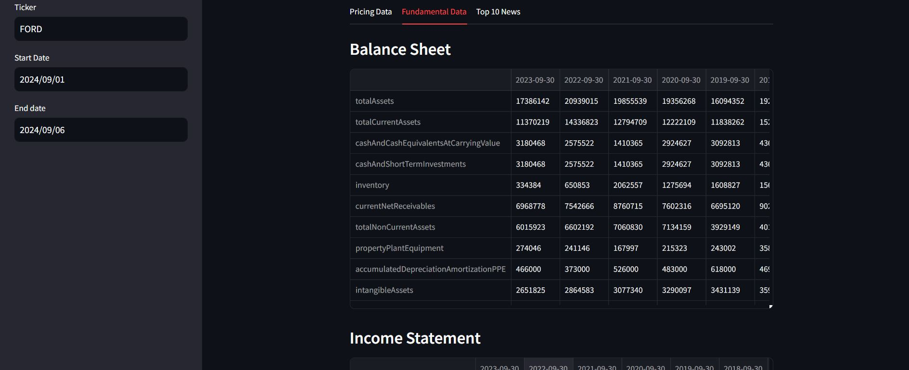

# Stock-Predictor

A predictor model for the stock market.
 
## Usage
go to Alpha vantage and get your own API key
it's free with limited actions. 

## FOR LINUX PURPOSES
most distros don't have Ta-lib
'''{bash}
wget https://github.com/ta-lib/ta-lib/releases/download/v0.6.4/ta-lib_0.6.4_amd64.deb
sudo dpkg -i ta-lib_0.6.4_amd64.deb
sudo apt-get install -f
python3 -m pip install --user TA-Lib
'''


open your environment in terminal
```{bash}
pip install r requirements.txt
```
in the terminal, run the following command
```{bash}
 streamlit run main.py
```





### License
This project is licensed under the Apache2.0 License. See the LICENSE file for details.

### Contributing
Feel free to open issues or submit pull requests to improve this project. Contributions are welcome!

Contact
For any questions or issues, please contact kanyibrandon@gmail.com.
