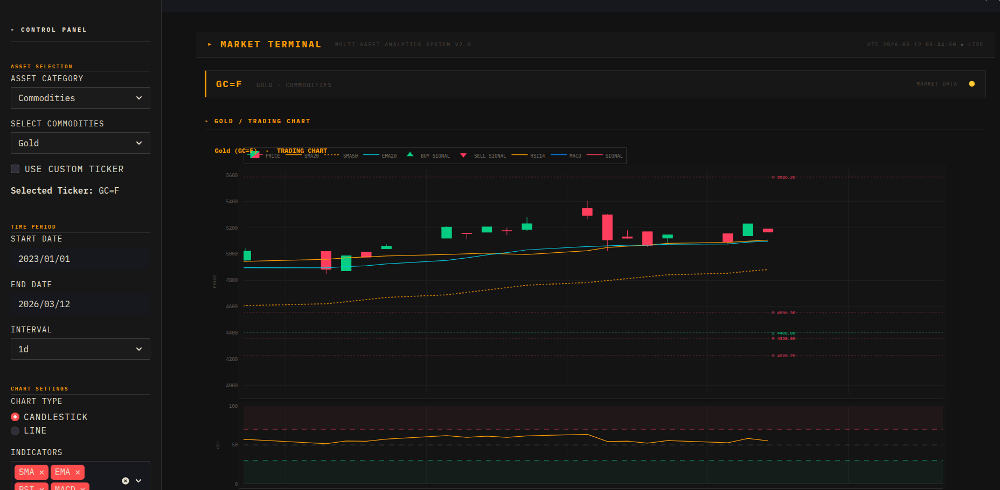
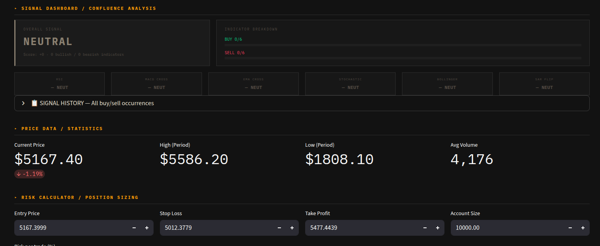
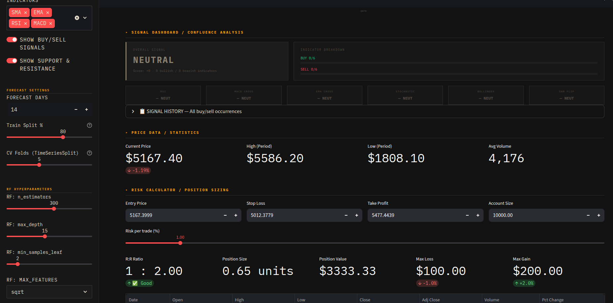
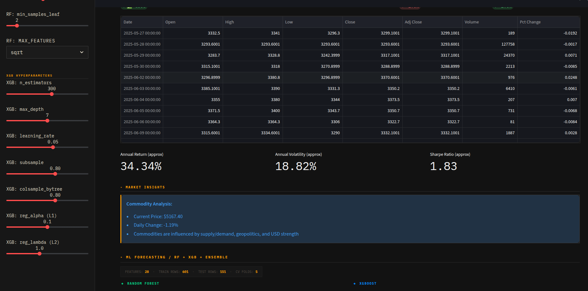
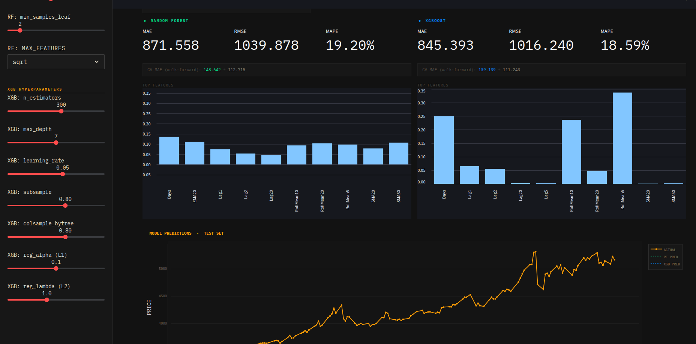
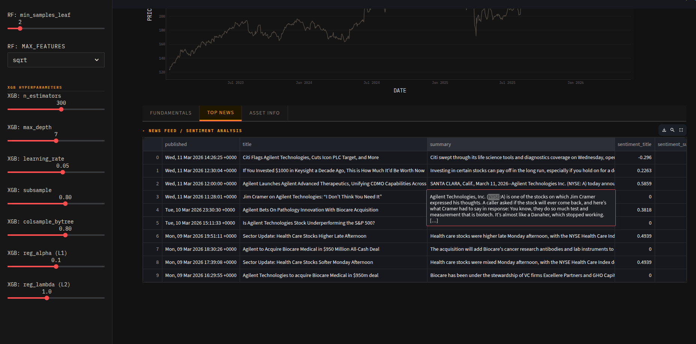

<!-- ========================= -->
<!-- DATA-SCIENCE THEMED HEADER -->
<!-- ========================= -->

<p align="center">
  
</p>

<p align="center">
  
</p>

<p align="center">
  <a href="https://your-streamlit-app-url.streamlit.app">
    
  </a>
  <a href="https://github.com/yourusername/Stock-Predictor">
    
  </a>
  
  
</p>

---

# 📈 Stock Predictor Dashboard

A **data-science powered stock analysis platform** built with **Streamlit** for exploring stock price movements, visualizing technical indicators, viewing company fundamentals, and generating predictive insights.

This project brings together **financial analytics**, **interactive charting**, and **machine learning concepts** in one clean dashboard.

---

## ✨ Features

- Historical stock price analysis
- Interactive charts and trend visualization
- Technical indicators
- Linear regression insights
- Fundamental company data with Alpha Vantage
- Secure API key handling with `.streamlit/secrets.toml` or environment variables
- Streamlit-based responsive UI

---

## 🖼️ Application Preview

### Dashboard Overview


### Stock Price Visualization


### Technical Indicator Analysis


### Regression Prediction View


### Fundamental Data Panel


### Full Analytics Interface


---

## 🧠 Tech Stack

- **Python**
- **Streamlit**
- **Pandas**
- **NumPy**
- **Plotly / Bokeh**
- **Scikit-learn**
- **yFinance**
- **Alpha Vantage API**

---

## 📊 GitHub Stats

<p align="center">
  
  
</p>

<p align="center">
  
</p>

---

## 🏗️ Project Structure

```bash
Stock-Predictor/
│
├── main2.py
├── requirements.txt
├── README.md
├── .env
│
├── .streamlit/
│   └── secrets.toml
│
├── 1.png
├── 2.png
├── 3.png
├── 4.png
├── 5.png
└── 6.png
```


⚙️ Installation
1. Clone the repository
```git clone https://github.com/yourusername/Stock-Predictor.git
cd Stock-Predictor
```
3. Create and activate an environment

Conda

```conda create -n stock python=3.11
conda activate stock

venv

python -m venv venv
```

Linux / Mac / Nobara

```source venv/bin/activate```

Windows

```venv\Scripts\activate```
3. Install dependencies
```pip install -r requirements.txt```

If you do not have a requirements.txt yet:

```pip install streamlit pandas numpy yfinance plotly requests scikit-learn bokeh```
## ⚠️ Note for Windows Users

Some setups on Windows may fail when installing TA-Lib, because it depends on compiled C libraries that are often harder to build on Windows.

If your project includes ta-lib and installation fails:

Option 1: Remove ta-lib from requirements.txt

If it is not critical for your current app, remove it and use alternatives based on:

pandas

numpy

rolling averages

custom indicator functions

Option 2: Use precompiled wheels

If you specifically need TA-Lib on Windows, you may need a compatible prebuilt wheel for your Python version and system architecture.

Option 3: Develop on Linux / WSL

TA-Lib is generally easier to install on:

Linux

WSL

Conda-based environments

A practical note for beginners: if the app works without TA-Lib, it is usually easier to skip it on Windows rather than spending too much time on compilation issues.

## 🔑 API Key Setup

This project uses Alpha Vantage for some fundamental data.

Option 1: Streamlit secrets

Create this file:

```toml
.streamlit/secrets.toml
```

Add:
```TOML
ALPHAVANTAGE_API_KEY = "your_api_key_here"
```
Option 2: Environment variable

Linux / Mac / Nobara
```bash
export ALPHAVANTAGE_API_KEY="your_api_key_here"
```

Windows PowerShell
```powershell
setx ALPHAVANTAGE_API_KEY "your_api_key_here"
```
▶️ Run the App
```bash
streamlit run main2.py
```

Then open:

http://localhost:8501

## 🚀 Live Demo

Click below to launch the deployed dashboard:

## 📌 Future Improvements

AI-based prediction models

Portfolio tracking

Crypto and forex analytics

Sentiment analysis from financial news

Real-time market feed integration

Model performance comparison dashboard

## 👨‍💻 Author

Brandon Kanyi

Data Science

Python Development

Financial Analytics

Machine Learning Projects

## ⭐ Contributing

Contributions are welcome.

Fork the repo

Create your feature branch

Commit your changes

Open a pull request

## 📄 License

This project is licensed under the MIT License.

## 💬 Support

If you run into issues or want improvements added, open an issue in the repository.

<p align="center">  </p> ```

Replace these two placeholders:

yourusername

https://your-streamlit-app-url.streamlit.app
